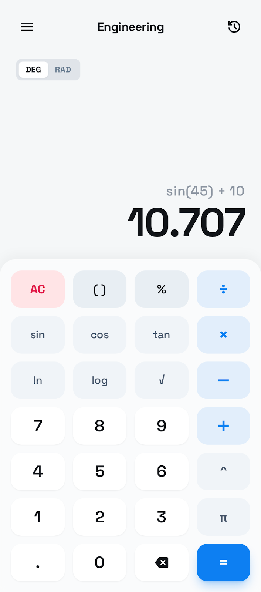
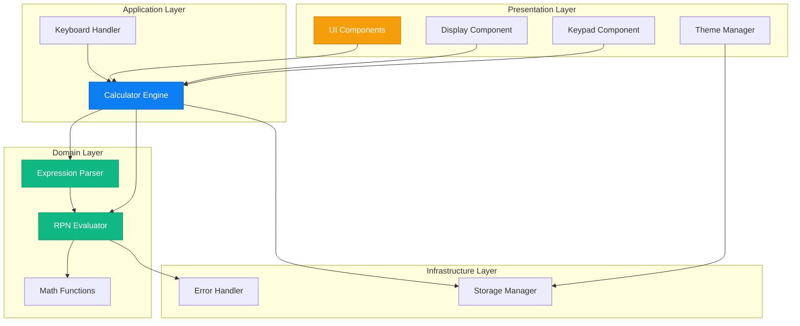
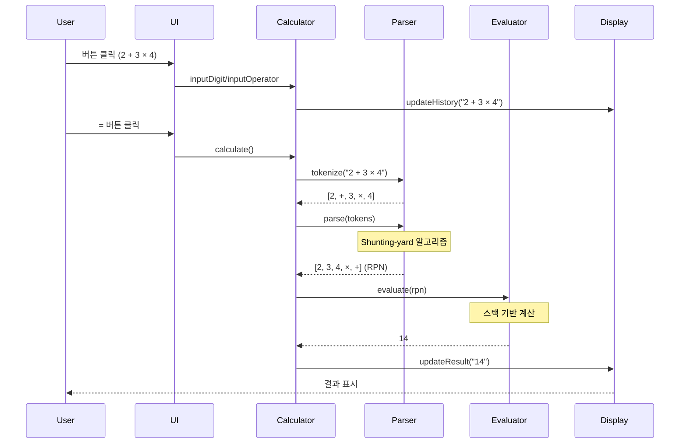
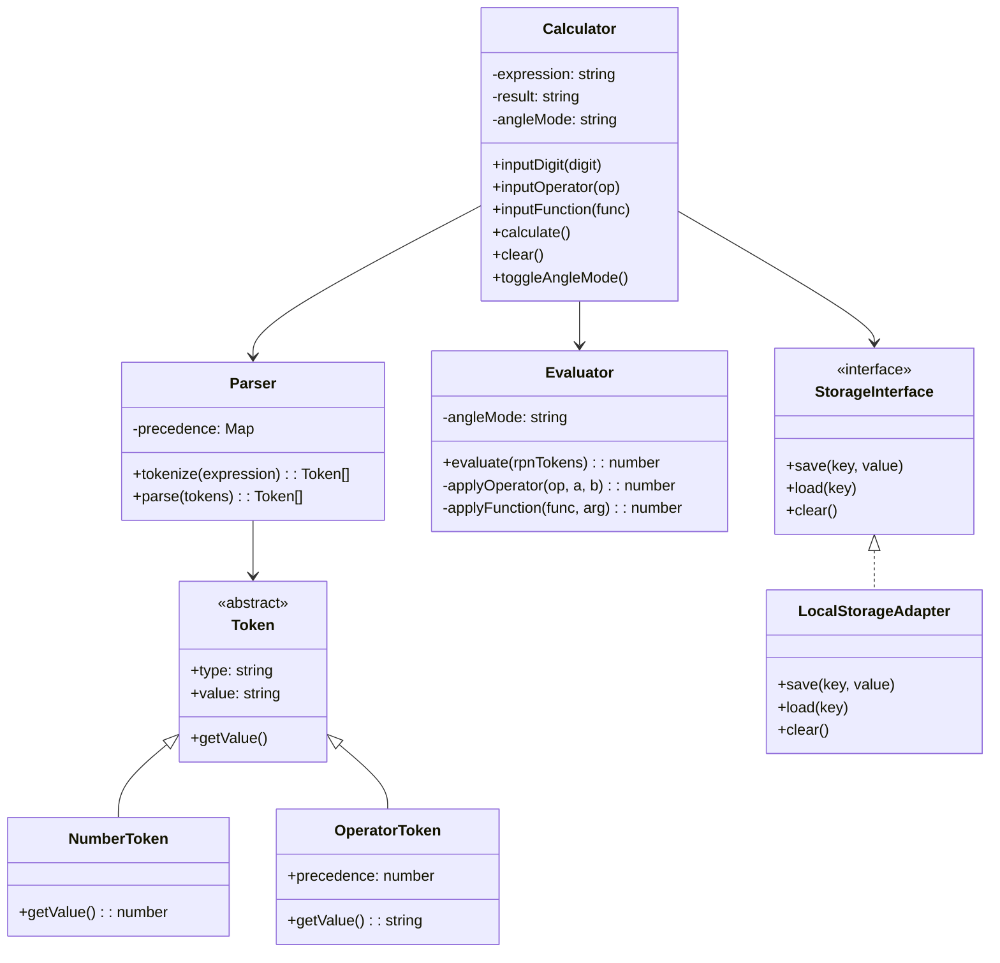

# 🧮 Engineering Calculator Web App

> **모던 웹 기술과 소프트웨어 공학 원칙을 적용한 공학용 계산기**  
> TDD, SOLID, Clean Architecture를 실천한 프로덕션 레벨 프로젝트

[](https://kwang-min13.github.io/calculator/)
[](https://github.com/kwang-min13/calculator)
[](https://opensource.org/licenses/MIT)



---

## 📌 프로젝트 개요

이 프로젝트는 단순한 계산기 구현을 넘어, **현대적인 소프트웨어 개발 방법론과 베스트 프랙티스를 실제로 적용**한 웹 애플리케이션입니다. 학습과 실무 경험을 결합하여 **프로덕션 환경에 배포 가능한 수준의 품질**을 목표로 개발되었습니다.

### 🎯 핵심 가치

- **테스트 주도 개발 (TDD)**: 코어 로직 90% 이상의 테스트 커버리지
- **SOLID 원칙 준수**: 유지보수 가능하고 확장 가능한 아키텍처
- **Clean Code**: ESLint, Prettier를 통한 일관된 코드 스타일
- **모던 UI/UX**: 다크모드, 반응형 디자인, 접근성 (WCAG 2.1 AA)
- **CI/CD 자동화**: GitHub Actions를 통한 자동 빌드/배포

---

## ✨ 주요 기능

### 계산 기능
- ✅ **기본 연산**: 사칙연산 (+, -, ×, ÷), 거듭제곱 (^), 제곱근 (√)
- ✅ **공학 함수**: sin, cos, tan, ln, log
- ✅ **각도 모드**: DEG/RAD 전환
- ✅ **괄호 지원**: 복잡한 수식 계산 (예: `(2 + 3) × sin(45)`)
- ✅ **에러 처리**: 0으로 나누기, 음수의 로그 등 수학적 오류 감지

### UI/UX
- 🎨 **다크모드**: 시스템 설정 자동 감지 및 전환
- 📱 **반응형 디자인**: 모바일, 태블릿, 데스크톱 완벽 지원
- ⌨️ **키보드 지원**: 숫자, 연산자, Enter, Escape, Backspace
- ♿ **접근성**: ARIA 속성, 키보드 네비게이션, 스크린 리더 지원

---

## 🏗️ 아키텍처

### 시스템 아키텍처



### 계산 플로우



### 클래스 다이어그램 (핵심 모듈)



---

## 🛠️ 기술 스택

### Frontend
- **Vanilla JavaScript (ES2022+)**: 프레임워크 없이 순수 JS로 구현하여 기본기 강화
- **Vite**: 빠른 개발 서버와 최적화된 프로덕션 빌드
- **Tailwind CSS**: 유틸리티 우선 CSS 프레임워크

### Testing & Quality
- **Vitest**: 단위 테스트 (코어 로직 90%+ 커버리지)
- **ESLint**: 코드 품질 검사
- **Prettier**: 일관된 코드 포맷팅

### DevOps
- **GitHub Actions**: CI/CD 파이프라인 (자동 빌드, 테스트, 배포)
- **GitHub Pages**: 정적 사이트 호스팅

---

## 💡 기술적 하이라이트

### 1. Test-Driven Development (TDD)

**모든 코어 로직을 TDD로 구현**하여 높은 코드 품질과 신뢰성을 확보했습니다.

```javascript
// 예시: Calculator 테스트
describe('Calculator', () => {
  it('should handle operator precedence correctly', () => {
    calc.inputDigit('2');
    calc.inputOperator('+');
    calc.inputDigit('3');
    calc.inputOperator('×');
    calc.inputDigit('4');
    calc.calculate();
    expect(calc.result).toBe('14'); // 2 + (3 × 4) = 14
  });
});
```

**테스트 커버리지**: 90% 이상 (Statements, Branches, Functions, Lines)

### 2. SOLID 원칙 적용

#### Single Responsibility Principle (SRP)
각 클래스는 단일 책임만 가집니다.
- `Parser`: 수식 파싱만 담당
- `Evaluator`: 계산만 담당
- `Calculator`: 상태 관리 및 조율만 담당

#### Dependency Inversion Principle (DIP)
구체적인 구현이 아닌 추상화에 의존합니다.

```javascript
// StorageInterface에 의존 (구체적인 LocalStorage가 아님)
class Calculator {
  constructor(storage: StorageInterface) {
    this.storage = storage;
  }
}
```

### 3. Shunting-yard 알고리즘

**중위 표기법을 후위 표기법(RPN)으로 변환**하여 연산자 우선순위를 정확히 처리합니다.

```
입력: 2 + 3 × 4
중위 표기법: [2, +, 3, ×, 4]
후위 표기법: [2, 3, 4, ×, +]
결과: 14 (올바른 우선순위 적용)
```

### 4. 성능 최적화

- **번들 크기**: < 100KB (gzipped)
- **Lighthouse 점수**: Performance 90+, Accessibility 90+
- **Tree Shaking**: 미사용 코드 자동 제거
- **CSS Purging**: 미사용 Tailwind 클래스 제거

---

## 📊 프로젝트 통계

| 항목 | 수치 |
|------|------|
| **코드 라인 수** | ~2,000 lines |
| **테스트 커버리지** | 90%+ |
| **컴포넌트 수** | 7개 (Display, Keypad, Button, etc.) |
| **지원 함수** | 10개 (sin, cos, tan, ln, log, sqrt, etc.) |
| **개발 기간** | 2-3주 (예상) |
| **커밋 수** | 50+ (예상) |

---

## 🚀 빠른 시작

### 설치 및 실행

```bash
# 저장소 클론
git clone https://github.com/kwang-min13/calculator.git
cd calculator

# 의존성 설치
npm install

# 개발 서버 시작
npm run dev
# → http://localhost:5173 접속
```

### 빌드 및 배포

```bash
# 프로덕션 빌드
npm run build

# 빌드 결과 미리보기
npm run preview
# → http://localhost:4173/calculator/ 접속
```

### 테스트 실행

```bash
# 단위 테스트
npm run test

# 테스트 커버리지 확인
npm run test -- --coverage

# Watch 모드
npm run test -- --watch
```

---

## 📁 프로젝트 구조

```
calculator/
├── src/
│   ├── core/              # 계산 엔진 (TDD로 구현)
│   │   ├── Calculator.js
│   │   ├── Parser.js
│   │   ├── Evaluator.js
│   │   └── Token.js
│   ├── utils/             # 유틸리티 함수 (TDD로 구현)
│   │   ├── mathFunctions.js
│   │   ├── errorHandler.js
│   │   ├── storage.js
│   │   └── constants.js
│   ├── components/        # UI 컴포넌트
│   │   ├── Display.js
│   │   ├── Keypad.js
│   │   └── Button.js
│   └── main.js            # 앱 진입점
├── tests/
│   └── unit/              # 단위 테스트 (90%+ 커버리지)
├── docs/
│   ├── PRD.md             # 제품 요구사항 문서
│   ├── TECH_SPEC.md       # 기술 명세서
│   └── rules/             # 개발 규칙 (TDD, SOLID)
└── .github/
    └── workflows/         # CI/CD 파이프라인
```

---

## 🎓 학습 성과

이 프로젝트를 통해 다음을 학습하고 실천했습니다:

### 소프트웨어 공학
- ✅ **TDD (Test-Driven Development)**: Red-Green-Refactor 사이클
- ✅ **SOLID 원칙**: 객체지향 설계 5대 원칙 적용
- ✅ **Clean Architecture**: 계층 분리 및 의존성 관리
- ✅ **Design Patterns**: Strategy, Adapter 패턴 활용

### 알고리즘 & 자료구조
- ✅ **Shunting-yard 알고리즘**: 수식 파싱
- ✅ **Stack 기반 계산**: RPN (Reverse Polish Notation) 평가
- ✅ **Tokenization**: 문자열 파싱 및 토큰화

### 웹 개발
- ✅ **Vanilla JavaScript**: 프레임워크 없이 순수 JS 구현
- ✅ **반응형 디자인**: Mobile-first 접근
- ✅ **접근성 (a11y)**: WCAG 2.1 AA 준수
- ✅ **성능 최적화**: Lighthouse 90+ 달성

### DevOps
- ✅ **CI/CD**: GitHub Actions 파이프라인 구축
- ✅ **자동화 배포**: GitHub Pages 자동 배포
- ✅ **코드 품질 관리**: ESLint, Prettier, Vitest

---

## 📈 개선 및 확장 계획

### Phase 6: Post-MVP 기능 (선택사항)
- [ ] **히스토리 기능**: 계산 기록 저장 및 재사용
- [ ] **추가 함수**: 역삼각함수, 쌍곡선 함수, 팩토리얼
- [ ] **메모리 기능**: M+, M-, MR, MC
- [ ] **단위 변환**: 길이, 무게, 온도 변환
- [ ] **그래프 기능**: 함수 그래프 시각화

---

## 🤝 기여

이슈 및 PR은 언제나 환영합니다!

1. Fork the Project
2. Create your Feature Branch (`git checkout -b feature/AmazingFeature`)
3. Commit your Changes (`git commit -m 'feat: Add some AmazingFeature'`)
4. Push to the Branch (`git push origin feature/AmazingFeature`)
5. Open a Pull Request

---

## 📝 라이선스

이 프로젝트는 MIT 라이선스 하에 배포됩니다. 자세한 내용은 [LICENSE](LICENSE) 파일을 참조하세요.

---

## 👨‍💻 개발자

**Kwang Min**
- GitHub: [@kwang-min13](https://github.com/kwang-min13)
- Portfolio: [Live Demo](https://kwang-min13.github.io/calculator/)

---

## 🙏 감사의 말

이 프로젝트는 다음 리소스를 참고하여 개발되었습니다:
- [Shunting-yard Algorithm](https://en.wikipedia.org/wiki/Shunting-yard_algorithm) - Edsger Dijkstra
- [Clean Code](https://www.amazon.com/Clean-Code-Handbook-Software-Craftsmanship/dp/0132350882) - Robert C. Martin
- [Tailwind CSS](https://tailwindcss.com/) - UI 디자인 시스템

---

<div align="center">

**⭐ 이 프로젝트가 도움이 되었다면 Star를 눌러주세요! ⭐**

Made with ❤️ and ☕ by Kwang Min

</div>
